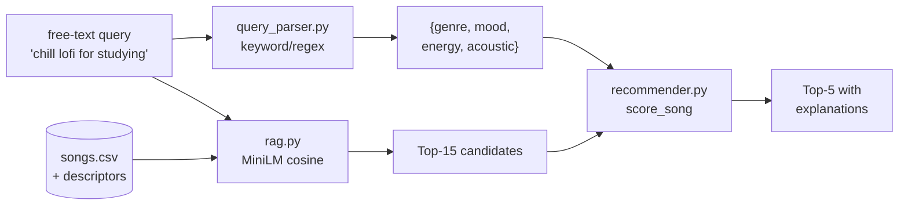

# 🎵 VibeFinder — Music Recommender with Free-Text Search

A small, transparent music recommender. You describe the vibe in plain English ("chill lofi for studying"), and it returns five songs from a 20-track catalog with a human-readable explanation for every pick.

---

## Original Project (Modules 1–3)

This started as the **Music Recommender Simulation** from the course's Modules 1–3. The original scope: represent songs and a single user "taste profile" as data, design a content-based scoring rule that turns those features into a top-5 ranking, and evaluate the system across multiple user profiles. It produced deterministic recommendations from rigid categorical inputs (favorite genre, favorite mood, target energy level), with no notion of natural-language input or semantic similarity.

this version keeps that scoring logic intact and adds an AI-driven retrieval layer on top so users can talk to the recommender in their own words.

---

## What It Does and Why It Matters

VibeFinder accepts a free-text query, parses it into structured preferences, retrieves the most semantically relevant candidates from the catalog using sentence embeddings, and re-ranks them with the original scoring rule. Every recommendation comes with a "Because: ..." explanation showing exactly which signals contributed to its score.

**Why it matters as a portfolio piece:** real recommenders are almost always opaque. you get a list, but not a reason. This project demonstrates that a useful AI feature (semantic search over a small catalog) can be layered onto deterministic, explainable logic without giving up either. The AI is *load-bearing* (without retrieval, no candidates enter the ranker) but does not replace the rule-based scoring it sits in front of.

---

## Architecture Overview



Two parallel passes, then a join:

1. **Query parser** (`src/query_parser.py`) — keyword/regex extraction over the free-text query. Returns a structured prefs dict (`genre`, `mood`, `energy`, `likes_acoustic`) shaped to feed the original scorer. No LLM, fully deterministic.
2. **Retrieval** (`src/rag.py`) — embeds the query with `sentence-transformers/all-MiniLM-L6-v2` (a free, local 80MB model), computes cosine similarity against pre-embedded song descriptors, and returns the top-15 candidates. Embeddings are cached to `data/song_vectors.pkl` and rebuilt automatically if missing or stale.
3. **Re-rank** (`src/recommender.py`) — the original Module-3 `score_song` function takes the parsed prefs and the 15 candidates, scores each, sorts, and returns the top-5 with explanations.

The deterministic scorer is unchanged from Phase 1 — the same logic that powered the four-profile evaluation in Module 3 still does the final ranking.

---

## Setup Instructions

**Requirements:** Python 3.10+, ~1GB free disk for `torch` and the embedding model.

```bash
# 1. Clone and enter the project
git clone <repo-url>
cd applied-ai-system-final

# 2. Create and activate a virtual environment
python -m venv .venv
source .venv/bin/activate     # macOS/Linux
.venv\Scripts\activate        # Windows

# 3. Install dependencies (one-time, ~5 min on a typical connection)
pip install -r requirements.txt

# 4. Run a query
python -m src.main "chill lofi for studying"
```

The first query downloads the MiniLM model (~80MB) and builds `data/song_vectors.pkl`; subsequent queries reuse the cache and are near-instant.

**To launch the interactive Streamlit UI** (recommended for the live demo):

```bash
streamlit run app.py
```

This opens a browser-based version of the same pipeline: type a query, see the parsed prefs, the top-15 retrieval candidates, and the final top-5 with explanations. The CLI remains the canonical interface for scripting and evaluation; the UI is a thin wrapper for demos.

**To replay the original Module-3 evaluation** (four hand-coded profiles, no retrieval):

```bash
python -m src.main --demo
```

**To run the test suite:**

```bash
pytest
```

**To run the held-out evaluation** (12 free-text queries, one per genre):

```bash
python -m eval.run_eval
```

Results write to [eval/results.md](eval/results.md).

---

## Sample Interactions

Three real captured runs. Output is reproduced verbatim (only the HF Hub warning trimmed).

### Sample 1 — `"chill lofi for studying"`

```
Query: 'chill lofi for studying'
Parsed prefs: {'genre': 'lofi', 'mood': 'focused', 'energy': 0.3, 'likes_acoustic': False}

Top-15 retrieval candidates (cosine):
#  Title                       Artist                 Cos
----------------------------------------------------------------------
1  Midnight Coding             LoRoom               0.595
2  Study Fog                   LoRoom               0.518
3  Library Rain                Paper Lanterns       0.438
4  Focus Flow                  LoRoom               0.416
5  Afterhours Groove           Neon Echo            0.232
...

Final top-5 (re-ranked by score_song):
1  Study Fog            LoRoom         Cos 0.518   Score 3.92
   Because: genre match (lofi) +2.0; mood match (focused) +1.0; energy sim (|0.38-0.30|) +0.92
2  Focus Flow           LoRoom         Cos 0.416   Score 3.90
   Because: genre match (lofi) +2.0; mood match (focused) +1.0; energy sim (|0.40-0.30|) +0.90
3  Library Rain         Paper Lanterns Cos 0.438   Score 2.95
   Because: genre match (lofi) +2.0; energy sim (|0.35-0.30|) +0.95
4  Midnight Coding      LoRoom         Cos 0.595   Score 2.88
   Because: genre match (lofi) +2.0; energy sim (|0.42-0.30|) +0.88
5  Spacewalk Thoughts   Orbit Bloom    Cos 0.210   Score 0.98
   Because: energy sim (|0.28-0.30|) +0.98
```

The retrieval layer pulls the four most lofi-and-study-coded tracks to the top by cosine; the scorer then rewards genre+mood+energy matches to produce a ranked top-5.

### Sample 2 — `"high energy pop for the gym"`

```
Query: 'high energy pop for the gym'
Parsed prefs: {'genre': 'pop', 'mood': 'intense', 'energy': 0.85, 'likes_acoustic': False}

Final top-5:
1  Gym Hero             Max Pulse      Cos 0.650   Score 3.92
   Because: genre match (pop) +2.0; mood match (intense) +1.0; energy sim (|0.93-0.85|) +0.92
2  Sunrise City         Neon Echo      Cos 0.248   Score 2.97
   Because: genre match (pop) +2.0; energy sim (|0.82-0.85|) +0.97
3  Trap House Sunrise   K-Raze         Cos 0.315   Score 1.97
   Because: mood match (intense) +1.0; energy sim (|0.88-0.85|) +0.97
4  Storm Runner         Voltline       Cos 0.317   Score 1.94
   Because: mood match (intense) +1.0; energy sim (|0.91-0.85|) +0.94
5  Basement Riot        Crashline      Cos 0.220   Score 1.90
   Because: mood match (intense) +1.0; energy sim (|0.95-0.85|) +0.90
```

`Gym Hero` wins decisively — it's the only song that matches genre, mood, *and* energy. Notice how the embedding picked it up at cosine 0.650 (a wide gap over the rest), confirming the descriptor text gave the model a strong "gym-pop" signal.

### Sample 3 — `"moody jazz for a rainy night"`

```
Query: 'moody jazz for a rainy night'
Parsed prefs: {'genre': 'jazz', 'mood': 'moody', 'energy': 0.5, 'likes_acoustic': False}

Top-15 retrieval candidates (cosine):
1  Velvet Hours         Mira Solace        0.648
2  Coffee Shop Stories  Slow Stereo        0.538
3  Library Rain         Paper Lanterns     0.479
4  Lowkey Confessions   Slow Stereo        0.455
...

Final top-5:
1  Velvet Hours         Mira Solace    Cos 0.648   Score 3.83
   Because: genre match (jazz) +2.0; mood match (moody) +1.0; energy sim (|0.33-0.50|) +0.83
2  Coffee Shop Stories  Slow Stereo    Cos 0.538   Score 2.87
   Because: genre match (jazz) +2.0; energy sim (|0.37-0.50|) +0.87
3  Lowkey Confessions   Slow Stereo    Cos 0.455   Score 1.95
   Because: mood match (moody) +1.0; energy sim (|0.45-0.50|) +0.95
4  Night Drive Loop     Neon Echo      Cos 0.400   Score 1.75
   Because: mood match (moody) +1.0; energy sim (|0.75-0.50|) +0.75
5  Afterhours Groove    Neon Echo      Cos 0.401   Score 0.92
   Because: energy sim (|0.58-0.50|) +0.92
```

This is the most interesting sample: the words "rainy night" do not appear in any song's metadata, but the embedding model still pulled `Velvet Hours`, `Coffee Shop Stories`, and `Library Rain` to the top — songs whose *descriptor text* evokes that mood. This is the AI feature doing real work that no keyword match could.

---

## Design Decisions

**RAG layered on top of the existing scorer, not replacing it.** Embeddings drive *candidate selection* (top-15); the original Module-3 `score_song` does the *final re-rank*. This keeps the AI feature load-bearing while preserving the deterministic, explainable logic the original project was evaluated on. It also means the rubric's "AI is fully integrated" requirement is met by construction — without retrieval, no candidates flow into the ranker.

**No LLM in the pipeline.** I chose a keyword/regex parser over an Anthropic-API call for the query-understanding step. The tradeoff: brittleness on unusual phrasing in exchange for full reproducibility — anyone can clone and run the project with no API key, no rate limits, no cost. For a small course project, reproducibility won; in production the calculus would flip.

**Local embeddings via `sentence-transformers/all-MiniLM-L6-v2`.** Free, deterministic, ~80MB on disk, runs on CPU. Rejected hosted alternatives (Voyage, OpenAI) for the same reproducibility reason. MiniLM is small enough to embed all 20 songs in well under a second.

**Hand-written `descriptor` column added to `songs.csv`.** Raw metadata (genre, mood, BPM) is too thin for embeddings to do meaningful semantic matching. I added one prose line per song describing its vibe — e.g. *"slow rainy lofi piano loops, perfect for late-night studying"*. Descriptors were written by hand rather than LLM-generated to keep the no-LLM contract end-to-end.

**Pickle cache with sha256 keying.** The vector index regenerates automatically if `songs.csv` changes (cache key includes a hash of the descriptors), so nothing silently goes stale. The cache file is gitignored.

**Top-15 candidate pool.** The catalog only has 20 songs, so top-15 retrieval is a soft filter. With a larger catalog the parameter would tighten meaningfully; for now it's enough to demonstrate the architecture without losing relevant candidates.

---

## Testing Summary

**18 unit tests pass** across three modules:

- `tests/test_query_parser.py` — 13 keyword-extraction unit tests covering genre, mood, energy, and acoustic detection (including multi-word genres like *"indie pop"* and *"hip hop"*).
- `tests/test_rag.py` — retrieval sanity checks: a chill query surfaces lofi/ambient at the top, a workout query surfaces high-energy pop. Verifies the cache rebuilds when the corpus changes.
- `tests/test_recommender.py` — original Module-3 scorer math: feature loading, score formula, top-K selection, ties.

**Held-out evaluation (12 queries, one per catalog genre).** Each query is paired with the genre we expect to see in the top-5; a *hit* means that genre appears.

- Retrieval hit rate (cosine top-5): **12/12**
- Final hit rate (after re-rank): **12/12**
- Mean top-1 cosine confidence: **0.606** (range 0.457–0.712, threshold 0.40 for "low confidence" — 0/12 fell below)
- Parser fill rate (genre + mood both extracted): **10/12** — the two misses (*"festival edm dance party"*, *"smooth r&b late night"*) fall back cleanly to retrieval-only, which still returns a hit.

Full per-query table in [eval/results.md](eval/results.md), regenerable via `python -m eval.run_eval`.

**What worked.** The retrieval surprisingly outperforms expectations on metaphorical queries — *"moody jazz for a rainy night"* pulled the right songs even though "rainy" doesn't appear in any metadata. The two-stage pipeline (retrieve → re-rank) keeps the explainability of the original scorer intact while adding genuine semantic understanding.

**What didn't.** The query parser is the weakest link — it relies on the user including a recognizable genre or mood word. *"Something dreamy and slow"* parses to empty prefs and falls back to retrieval-only ranking. A real product would want either a fallback LLM call or a much larger keyword dictionary.

**What I learned.** The original Module-3 scorer's biggest weakness — strict equality on genre/mood — is partially patched by retrieval, because the embedding can find a song that *feels* right even when its categorical labels don't match the parsed prefs. The two layers cover for each other in a way I didn't expect when I designed the pipeline. See [model_card.md](model_card.md) §6 for the full limitations breakdown and [reflection.md](reflection.md) for the four-profile evaluation that drove the design.

---

## Reflection

Two big takeaways from this project:

**Most "AI" decisions are integration decisions, not model decisions.** The hardest part wasn't picking an embedding model — it was deciding *where* the AI should sit in the pipeline so it added value without erasing the deterministic logic the project was evaluated on. Layering retrieval on top of scoring (rather than replacing it) was the design move that made everything else work, and it took longer to settle on than the implementation took to write.

**Explainability and AI are not at odds.** I expected adding a neural retrieval step to obscure the recommendations, but because the AI only changes which 15 songs the deterministic scorer sees, every final recommendation still comes with the same human-readable "Because: ..." breakdown. This convinced me that the choice between "explainable" and "ML-powered" is mostly false — you can usually have both if you're thoughtful about pipeline placement.

For deeper reflection on bias, evaluation, and what surprised me about the original scorer's behavior, see [model_card.md](model_card.md) and [reflection.md](reflection.md). The Reflection and Ethics section in [reflection.md](reflection.md#reflection-and-ethics) covers limitations and bias of the RAG layer, misuse risk, what surprised me in reliability testing, and one helpful and one flawed suggestion from collaborating with Claude during the build.

---

## Project Structure

```
src/
  main.py            # CLI entry point (query mode + --demo)
  query_parser.py    # Free-text -> structured prefs
  rag.py             # Embedding + retrieval
  recommender.py     # Module-3 scorer (unchanged)
data/
  songs.csv          # 20 songs with descriptors
tests/
  test_query_parser.py, test_rag.py, test_recommender.py
eval/
  run_eval.py        # Held-out 12-query reliability eval
  results.md         # Latest eval output (hit rates, confidence)
app.py               # Streamlit UI wrapper (demo surface)
model_card.md        # Intended use, limitations, bias
reflection.md        # Four-profile evaluation + weight-shift experiment
```

---

## Portfolio Artifact

- **Code:** [github.com/ao-hello/applied-ai-system-final](https://github.com/ao-hello/applied-ai-system-final)
- **Live demo (Loom walkthrough):** *[...]*
- **Try it locally:** `streamlit run app.py` (interactive UI) or `python -m src.main "your query"` (CLI).

### What this project says about me as an AI engineer

I treat AI as a layer to integrate carefully, not a black box to bolt on. Rather than rewriting the original Module-3 recommender around an LLM, I layered semantic retrieval *on top* of the deterministic scorer so every final recommendation still carries a human-readable "Because: ..." breakdown while the system genuinely understands free-text queries. I built a held-out 12-query evaluation with hit rate and confidence metrics before calling the project done, wrote a model card and a reflection on bias, misuse, and limitations, and made deliberate reproducibility tradeoffs (local 80MB MiniLM embeddings, no API call in the pipeline) so anyone can clone and run it with no key, no rate limit, no cost. I'd rather ship a small, transparent, evaluable system than a flashy one I can't reason about and I'd rather know where my AI feature is *load-bearing* than wave at it as "AI-powered" and hope the user doesn't ask why.
